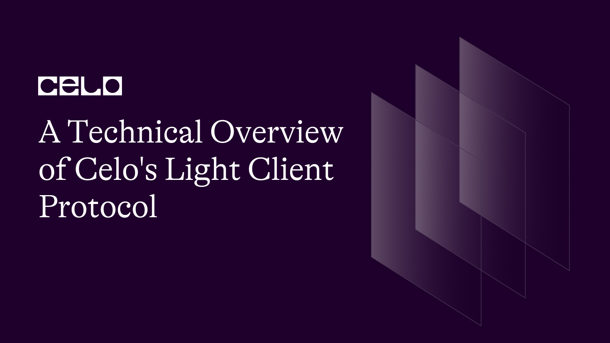
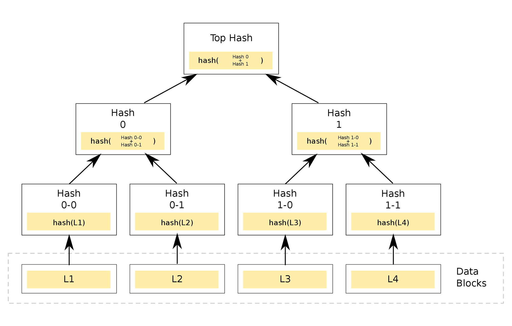
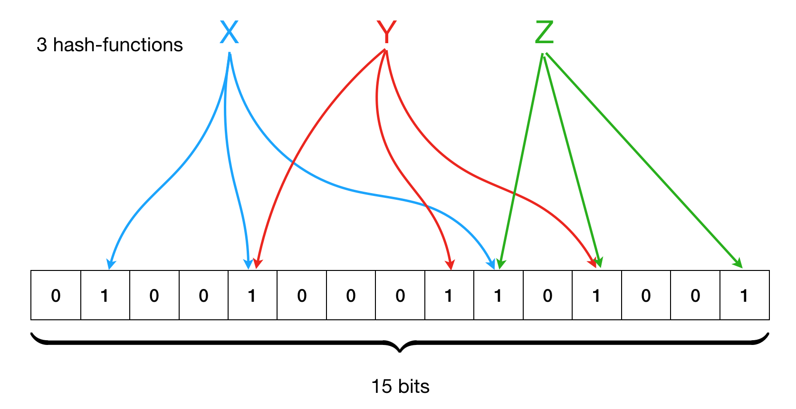

Celo's Light Client Protocol is a crucial component of the Celo blockchain's infrastructure, providing a means for mobile and other resource-constrained devices to interact with the blockchain in a lightweight and efficient manner.

This article offers a detailed technical overview of the protocol, covering key concepts such as Simplified Payment Verification (SPV), Merkle trees, and Bloom filter. We delve into the benefits of the protocol, including its ability to reduce bandwidth requirements and minimize the time and storage required for synchronization. It also explores the use cases for the protocol, highlighting its suitability for mobile wallet applications, peer-to-peer payments, and other decentralized applications.

This article is aimed at developers and blockchain enthusiasts who want to understand the technical workings of the Celo Light Client Protocol and how it can be leveraged to build innovative and efficient applications on the Celo blockchain.
 

## Introduction to Celo and its Light Client Protocol

The light client protocol is one of the core elements of the Celo network. Users can communicate with the network without having to download and store the entire blockchain thanks to the lightweight Celo light client protocol. As a result, fewer data needs to be transmitted and stored, which is important for users with low-end devices or in areas with poor connectivity.


The light client protocol is revolutionizing how clients can interact with the blockchain, and this excites us here at Celo. The Simplified Payment Verification (SPV) technology, which was first described in the Bitcoin whitepaper, is the foundation of this protocol. In essence, SPV enables users to validate transactions without downloading and storing the entire blockchain. Clients can instead depend on a network of full nodes to give them the pertinent transaction data they require. This is really cool because it allows users to interact with the network in a safe, trustworthy manner without sacrificing speed or user experience.


The Celo light client protocol builds on top of the SPV technology by introducing several optimizations that make it more efficient and user-friendly. For example, Celo light clients can verify transactions in real-time, allowing for instant confirmation of payments and transfers. They can also use a feature called "fast sync" to quickly download relevant blockchain data, further reducing the amount of data that needs to be transmitted.
 

## How Celo's Light Client Protocol Works

Celo's light client protocol is a way for users to interact with the Celo blockchain without needing to download and store the entire blockchain on their devices. This is particularly useful for users who have limited storage capacity or slow internet connections. When a user wants to interact with the Celo blockchain, they can connect to a light client node. The light client node will then query the full nodes on the network to get the information that the user needs. The light client node will only request the specific information that the user needs, rather than downloading the entire blockchain.

The light client protocol uses a technique called Simplified Payment Verification (SPV) to verify transactions. SPV allows the light client node to verify that a transaction has been included in a block without downloading the entire block. Instead, the light client node will download only the block headers, which contain a summary of the transactions in each block. The light client node can then use this summary to verify that a transaction has been included in a block.

The Merkle proof technique is employed by the light client protocol to authenticate the validity of a transaction by providing proof that the transaction is present in a block. To accomplish this, a hash tree of all the transactions contained in the block is created, with the root hash representing the complete block. The Merkle proof then offers a path from the transaction to the root hash, making it possible for the light client node to verify the presence of the transaction in the block without requiring the download of the whole block.


## Components of Celo's Light Client Protocol  

The Celo Light Client Protocol enables mobile devices and other lightweight hardware to interact with the Celo blockchain by reducing the amount of data that needs to be downloaded and stored on the device.

Traditionally, interacting with a blockchain requires downloading and storing the entire blockchain, which can be a significant challenge for mobile devices and other lightweight hardware due to limited storage capacity and processing power. However, with the Light Client Protocol, users only need to download and store a small portion of the blockchain relevant to their specific transaction or request.
The Light Client Protocol achieves this by using a few key components, including Simplified Payment Verification (SPV), Merkle trees, and Bloom filters. These components work together to allow the light client to verify the validity of a transaction or block header without having to download and store the entire blockchain.

This reduction in data requirements makes it possible for mobile devices and other lightweight hardware to interact with the Celo blockchain in a lightweight and efficient manner, opening up new use cases and opportunities for adoption. For example, users in regions where desktop or laptop computers are not widely available can still participate in the Celo network, making it more accessible and inclusive. Additionally, mobile devices can be used for transactions and other interactions while on the go, making it more convenient for users. 
This is made possible through the use of a few key components:

**Simplified Payment Verification (SPV)**: This is a protocol originally introduced in the Bitcoin whitepaper that allows clients to verify transactions without downloading and storing the entire blockchain. Celo's payment verification process allows users to confirm payment transactions without running a full network node. Instead, users can maintain a copy of the block headers of the longest proof-of-work chain, which they can obtain by querying network nodes until they have acquired the longest chain. Once they have the headers, they can also acquire the Merkle branch that links the transaction to the block it's time stamped in. This process verifies that a network node has accepted the transaction by checking its position in the chain.

 

While users cannot directly verify the transaction itself, subsequent blocks added to the chain further confirm its acceptance by the network. This provides an efficient and effective payment verification process that does not require the computational resources of running a full node.

**Merkle Tree**: A Merkle tree is a data structure that is used to verify that a specific transaction is included in a block on the blockchain. It does this by allowing a client to verify that a specific transaction is part of a block without having to download the entire block.

 

 A Merkle tree is constructed from the leaf nodes level all the way up to the Merkle root level by grouping nodes in pairs and calculating the hash of each pair of nodes in that particular level. This hash value is propagated to the next level. This is a bottom-to-up type of construction where the hash values are flowing from a down to up direction.


**Bloom Filter**: A Bloom filter is a probabilistic data structure that is used to test whether an element is a member of a set. It is used in the Celo Light Client Protocol to filter out irrelevant transactions and block headers. For example, checking the availability of a username is a set membership problem, where the set is the list of all registered usernames.

 

With these components in place, the Celo Light Client Protocol sends a request to a full node for a specific block header or transaction. The full node responds with the requested data, along with a Merkle proof that allows the light client to verify that the data is valid. The light client uses a Bloom filter to check whether any of the remaining transactions or block headers on the blockchain might be relevant to its request. If the Bloom filter indicates that there might be relevant data, the light client sends additional requests to the full node.


## Use Cases of Light Client Protocol on Celo

The Light Client Protocol is a critical component of the Celo ecosystem, enabling a wide range of users to interact with the Celo blockchain in a lightweight and efficient manner. It is integrated with other Celo technologies such as the mobile wallet and smart contracts to enable developers to build decentralized applications (DApps) on top of the Celo blockchain.

Celo's mobile wallet, [Valora](https://valoraapp.com/), is one of the primary tools for interacting with the Celo blockchain. The Light Client Protocol is integrated into the Valora wallet, enabling users to interact with the blockchain in a lightweight and efficient manner. This integration makes it possible for users to send and receive payments, earn rewards, and access other Celo features directly from their mobile devices. In addition to the Valora wallet, the Light Client Protocol is also integrated with Celo's smart contract platform. This integration allows developers to build DApps that can interact with the Celo blockchain without requiring users to download and store the entire blockchain. Instead, users can interact with the DApp using a light client that only downloads the relevant data needed to execute their transaction.

Developers can use the Light Client Protocol to build a wide range of DApps on top of the Celo blockchain. For example, they can build DApps for peer-to-peer payments, microlending, digital identity, and more. One example of a DApp that uses the Light Client Protocol is [Impact Market](https://www.impactmarket.com/), which enables users to invest in sustainable and impact-driven projects around the world.
Developers can create DApps that are usable by a wider range of users including those who might not have access to conventional desktop or laptop computers by utilizing the Light Client Protocol. Decentralized technologies may be adopted more widely as a result, increasing their accessibility and inclusivity.


Overall, the Light Client Protocol is a critical component of the Celo ecosystem, enabling lightweight and efficient interactions with the blockchain. By working in conjunction with other Celo technologies, it enables developers to build a wide range of DApps that can help to create a more inclusive and equitable financial system.
Here is an example code on how to implement light client protocol on Celo using the Web3.js library. Here's a code snippet that demonstrates how to use the light client protocol to query the Celo blockchain for the balance of a specific address:

```js
const Web3 = require('web3');
const CeloLightClient = require('@celo/contractkit/lib/celo-light-client');


// Initialize the Web3 provider
const providerUrl = 'https://celo-alfajores--rpc.datahub.figment.io/apikey/<API_KEY>/';
const web3Provider = new Web3.providers.HttpProvider(providerUrl);


// Initialize the Celo light client
const celoLightClient = new CeloLightClient({
  syncMode: 'light',
  rpcUrl: providerUrl
});


// Get the balance of a specific address
const address = '0x1234567890123456789012345678901234567890';
celoLightClient.contracts.getGoldToken()
  .then(goldToken => {
    return goldToken.balanceOf(address);
  })
  .then(balance => {
    console.log(`Balance of ${address}: ${balance.toString()}`);
  })
  .catch(error => {
    console.error(error);
  });
```

In this example, we first initialize the Web3 provider with the URL of a Celo node that supports light client protocol. We then initialize the Celo light client with the same URL and set the syncMode to 'light'. This tells the light client to use the light client protocol to interact with the Celo blockchain.

We then use the celoLightClient.contracts.getGoldToken() method to get an instance of the GoldToken contract, which represents the Celo Gold token on the blockchain. We can then call the balanceOf() method on the contract instance to get the balance of the specified address.

Finally, we log the balance to the console or log any errors that occur during the process.Note that this is just a simple example, and there are many other methods and contracts that can be accessed using the light client protocol on Celo.
 

## Conclusion

Celo's light client protocol allows users to interact with the Celo blockchain without downloading and storing the entire blockchain on their device, which is useful for users with limited storage or slow internet. The protocol uses Simplified Payment Verification (SPV) to verify transactions by downloading only block headers, and Merkle proof to authenticate the validity of a transaction by providing cryptographic proof that the transaction is present in a block. The protocol also uses Bloom filters to optimize the amount of data sent to the light client. This reduces data requirements, making it possible for mobile devices and lightweight hardware to interact with the Celo blockchain in a lightweight and efficient manner.


## Next Steps

I hope you learned a lot more about [Celo’s light client](https://github.com/ChorusOne/celo-light-client) protocol from this article. Please check out the Celo Light Client library to learn more. 

## About the Author

Kyrian Chigozie is a Technical Writer with a passion for web3 technology. Connect with me on [Twitter](https://twitter.com/Kyrian_M) and [LinkedIn](https://www.linkedin.com/in/kyrianm/).


## References
- [Celo Light Client](https://github.com/ChorusOne/celo-light-client)
- [Celo Docs](https://docs.celo.org/)
- [Celo SDK](https://github.com/celo-org/celo-monorepo/tree/master/packages/sdk)
- [Valora](https://valoraapp.com/)
- [Impact Market](https://www.impactmarket.com/)
- [Bitcoin Whitepaper](https://bitcoinwhitepaper.co/)
- [Bitcoin Wiki](https://wiki.bitcoinsv.io/index.php/Main_Page) 
- [Geeks for Geeks](https://www.geeksforgeeks.org/bloom-filters-introduction-and-python-implementation/)
 
 


